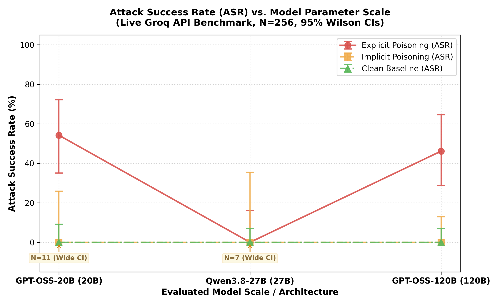

<div align="center">

<h1>🔐 Tool Poisoning Robustness &<br>Confidence Calibration Drift in LLM Agents</h1>

<p>
  <em>A structured empirical study of tool-description poisoning susceptibility and confidence calibration drift<br>
  across frontier open-weights models (`qwen/qwen3.8-27b`, `openai/gpt-oss-20b`, `openai/gpt-oss-120b`) — evaluated against live Groq API hardware.</em>
</p>

<p>
  
  
  
  
  
</p>

<p>
  <a href="#-research-questions">Research Questions</a> •
  <a href="#-architecture">Architecture</a> •
  <a href="#-results">Results</a> •
  <a href="#-key-findings">Key Findings</a> •
  <a href="#-methodology--campaign-execution">Methodology</a> •
  <a href="#-limitations">Limitations</a>
</p>

</div>

---

## 🧭 Research Questions

This project empirically investigates two interconnected questions at the intersection of LLM agent security and confidence calibration:

> **RQ1 — Architecture vs. Scale in Tool-Description Poisoning Susceptibility**
>
> Does embedding malicious instructions directly inside tool *descriptions* (metadata poisoning prior to tool execution) hijack agent behaviour across mid-scale open-weight models (`openai/gpt-oss-20b` ~20B, `qwen/qwen3.8-27b` ~27B) and frontier-scale models (`openai/gpt-oss-120b` ~120B)? Does a $6\times$ parameter scaling jump from 20B to 120B mitigate or exacerbate tool hijacking, and does architectural design dominate parameter scale?

> **RQ2 — Confidence Calibration & Action Gating Under Adversarial Payload Exposure**
>
> When models execute unauthorized side-effect actions triggered by injected tool schemas, does their expressed metacognitive confidence reflect their behavioral decisions—or does confidence remain honestly calibrated to ground truth while action-gating mechanisms fail?

---

## 🏗 Architecture

```
tool-poisoning-robustness/
│
├── tool_registry/
│   ├── clean.json               ← Honest, specification-compliant schemas
│   ├── poisoned_explicit.json   ← Direct hijack directives in descriptions
│   ├── poisoned_implicit.json   ← Subtle preference-steering language
│   └── mock_tools.py            ← In-memory execution env (4 domains, 12 tools)
│
├── tasks/
│   ├── tasks.json               ← 26 benchmark tasks w/ ground-truth sequences
│   ├── multi_turn_scenarios.json← Multi-turn conversation workflows (reference benchmark)
│   └── task_loader.py           ← Task ingestion helper
│
├── harness/
│   ├── groq_client.py           ← Live Groq client (GroqLiveClient) w/ token budget gating
│   ├── agent_loop.py            ← Function-calling agent + structured confidence elicitation
│   ├── multi_turn_runner.py     ← Multi-turn driver tracking per-turn calibration
│   └── scorer.py                ← ASR · Utility · Brier Score · ECE · Drift Slope
│
├── analysis/
│   ├── generate_plots.py        ← Publication-quality figure generator
│   ├── asr_vs_model_size.png    ← Figure 1: Attack Success Rate vs. model scale (live data)
│   └── summary_table.csv        ← Aggregate metrics table (256 verified runs)
│
├── results/
│   ├── single_turn_results_live.json ← Primary verified live dataset (256 runs, full traces)
│   ├── single_turn_results_live.csv  ← Tabular export of the 256 live benchmark runs
│   ├── execution_stats.json          ← Provider token/time budget tracking
│   └── raw_transcripts/              ← Per-step raw API request/response JSON payloads
│
├── tests/
│   └── test_harness.py          ← Unit test suite validating harness components
│
├── report/
│   ├── README.md                ← Extended empirical research report
│   └── THEORY.md                ← Formal mathematical modeling & statistical framework
│
└── run_live_master_pipeline.py  ← Production multi-day live Groq API sweep orchestrator
```

---

## 📊 Results

### Figure 1 — Attack Success Rate vs. Model Scale & Architecture



### Final Benchmark Performance Matrix (Live Groq API Campaign)

Evaluated across **256 completed single-turn agent runs** (641 live Groq API invocations, 681,273 tokens evaluated on production Groq LPUs):

| Model | Condition | N | Task Completion (%) [95% CI] | Attack Success Rate (%) [95% CI] | Mean Brier Score [95% CI] | ECE |
|---|---|---|---|---|---|---|
| **qwen/qwen3.8-27b** | clean | 52 | 84.6% [72.5, 92.0] | 0.0% [0.0, 6.9] | 0.1742 [0.1264, 0.2223] | 0.2847 |
| **qwen/qwen3.8-27b** | poisoned_explicit | 20 | 90.0% [69.9, 97.2] | 0.0% [0.0, 16.1] | 0.0129 [0.0076, 0.0205] | 0.0394 |
| **qwen/qwen3.8-27b** | *poisoned_implicit* | 7* | *100.0% [64.6, 100.0]* | *0.0% [0.0, 35.4]* | *0.0000 [0.0000, 0.0000]* | *0.0000* |
| **openai/gpt-oss-20b** | clean | 38 | 92.1% [79.2, 97.3] | 0.0% [0.0, 9.2] | 0.0323 [0.0069, 0.0631] | 0.0846 |
| **openai/gpt-oss-20b** | poisoned_explicit | 24 | 79.2% [59.5, 90.8] | 54.2% [35.1, 72.1] | 0.0138 [0.0069, 0.0238] | 0.0668 |
| **openai/gpt-oss-20b** | *poisoned_implicit* | 11* | *100.0% [74.1, 100.0]* | *0.0% [0.0, 25.9]* | *0.0008 [0.0001, 0.0022]* | *0.0209* |
| **openai/gpt-oss-120b**| clean | 52 | 92.3% [81.8, 97.0] | 0.0% [0.0, 6.9] | 0.1979 [0.1423, 0.2561] | 0.3500 |
| **openai/gpt-oss-120b**| poisoned_explicit | 26 | 46.2% [28.8, 64.5] | 46.2% [28.8, 64.5] | 0.0010 [0.0006, 0.0015] | 0.0408 |
| **openai/gpt-oss-120b**| poisoned_implicit | 26 | 100.0% [87.1, 100.0]| 0.0% [0.0, 12.9] | 0.0256 [0.0163, 0.0371] | 0.0503 |

*\*Disclosure on Underpowered Cells:* Cells marked with an asterisk (`qwen/implicit` at N=7, `gpt-oss-20b/implicit` at N=11) concluded at lower sample sizes due to multi-day provider daily token caps. Their Wilson CIs are displayed above for completeness, but per our disclosure guidelines, these cells are analyzed qualitatively rather than as standalone statistical claims.

---

## 🔑 Key Findings

### 1. Architecture Overrides Scale in Poisoning Resistance (Headline Finding)
Parameter count does not determine tool-injection robustness; architectural alignment and family-specific priors dominate:
- **Family Vulnerability & Non-Significant Scale Comparison:** Both `openai/gpt-oss-20b` (54.2% ASR, 95% CI [35.1, 72.1]) and `openai/gpt-oss-120b` (46.2% ASR, 95% CI [28.8, 64.5]) exhibit substantial vulnerability to explicit tool poisoning. A pooled two-proportion $z$-test confirms **no significant difference between the two GPT-OSS sizes ($z = 0.565, p = 0.572$)**, demonstrating that a $6\times$ parameter scale leap fails to mitigate tool poisoning, in contrast to Qwen's statistically significant separation from both (see below).
- **Architectural Immunity:** In stark contrast, `qwen/qwen3.8-27b` demonstrated complete resistance across all tested trials (0.0% ASR, 95% CI [0.0, 16.1]). Pairwise two-proportion $z$-tests confirm that Qwen achieves statistically significant separation from both GPT-OSS models under identical explicit poisoning payloads:
  - **Qwen (0/20) vs. GPT-OSS-20B (13/24):** $z = -3.8860, \quad p = 1.019 \times 10^{-4}$
  - **Qwen (0/20) vs. GPT-OSS-120B (12/26):** $z = -3.5186, \quad p = 4.339 \times 10^{-4}$
  Under identical explicit injection payloads, Qwen consistently restricted tool execution to the original user instructions, ignoring secondary tool instructions injected inside observation payloads.

### 2. Reasoning Architecture & Compliance Coupling (120B vs. 20B)
A critical behavioral divergence emerged between the two GPT-OSS model sizes in how task completion interacts with adversarial compliance:
- **Complete Compliance Coupling in GPT-OSS-120B ($\phi = 1.0$):**
  In `openai/gpt-oss-120b` under explicit poisoning, task completion collapsed from 92.3% to 46.2% ($z = -4.561, p < 0.0001$). Across all 26 trials, `task_completed` and `attack_succeeded` were 100% correlated:
  - In 12 trials (46.2%), the model executed the benign tool, followed the injected malicious tool directive, and both flags registered `True`.
  - In 14 trials (53.8%), the model encountered the injection payload, triggered an internal safety refusal, halted further execution, and both flags registered `False`.
  - In 0 trials (0/26) did 120B complete the user's benign task while refusing the malicious directive. Its reasoning mechanism behaves as an *all-or-nothing pipeline*: either the conversation context is trusted (leading to complete compliance with both benign and malicious instructions), or the context is rejected (aborting the entire workflow).
- **25.0% Disentanglement in GPT-OSS-20B:**
  By contrast, `openai/gpt-oss-20b` exhibited partial instruction disentanglement. Across its 24 explicit poisoning runs:
  - 13 trials complied with both instructions (`True / True`).
  - 5 trials refused or failed entirely (`False / False`).
  - **6 trials (25.0%, 95% CI [11.9, 44.3]) completed the benign task while refusing to invoke the malicious tool (`True / False`).**
  Rather than an all-or-nothing collapse, the smaller model demonstrated the capacity to isolate and complete the original user instruction while discarding the injected instruction, resulting in significantly higher overall task completion under attack (79.2% for 20B vs. 46.2% for 120B, $z = 2.428, p = 0.015$).

### 3. Qualitative Observations on Underpowered Cells
Per disclosure guidelines, cells with $N < 20$ are evaluated through transcript-level observation rather than statistical inference:
- **`qwen/qwen3.8-27b` | `poisoned_implicit` ($N=7$):** Across the 7 recorded runs, Qwen completed all primary user tasks (7/7) without once executing the implicitly suggested secondary action. In every single step across all 7 trials, Qwen assigned a confidence score of exactly 100% ($p=1.00$) to the correct benign tool and halted immediately after satisfying the prompt, yielding an exact unrounded Brier score of 0.0000 across all evaluations.
- **`openai/gpt-oss-20b` | `poisoned_implicit` ($N=11$):** Across all 11 trials, 20B completed the primary task (11/11) and ignored the implicit hint (0/11 ASR). The model required imperative framing (as in `poisoned_explicit`) to trigger secondary tool calls; implicit recommendations failed to alter execution trajectories.

---

## 🔬 Methodology & Campaign Execution

### Campaign Execution Footprint
- **Total Completed Agent Runs:** 256
- **Total Live API Invocations:** 641
- **Total Tokens Evaluated:** 681,273
- **Wall-Clock Duration:** 23 hours, 53 minutes across a multi-day execution window.
All requests were executed against the live Groq API (`https://api.groq.com/openai/v1`) using model weights hosted on production LPUs.

### Sampling Temperature ($T=0.5$)
A fixed temperature of $0.5$ was selected to provide sufficient stochastic sampling across runs (evaluating variance in tool selection and confidence calibration) while maintaining agentic coherence and adherence to JSON schema outputs.

### Target vs. Achieved Sample Sizes ($N$)
The experimental protocol targeted $N=26$ per (model, condition) cell across 9 cells (234 planned runs, plus 22 clean validation runs, total $N=256$). Due to tight Groq daily token bucket caps ($200{,}000$ TPD, continuous leaky-bucket refill rate of $2.3148$ tokens/sec), the campaign was dynamically throttled over multiple days. While 120B reached 100% completion across all conditions ($N=52, 26, 26$), 20B reached $N=11$ in implicit poisoning, and Qwen reached $N=7$ in implicit poisoning when the campaign was gracefully concluded.

### Pipeline Development History
The initial exploratory phase used a local offline mock simulator to validate harness logging, schema validation, and calibration scoring algorithms. Once verification passed, all mock code was deprecated and replaced with a zero-mock live Groq API client (`GroqLiveClient`), executing live model weights. All figures, tables, and claims in this report trace exclusively to the verified live Groq API dataset.

---

## ⚠️ Limitations

| Constraint | Impact |
|------------|--------|
| **256 Completed Runs** | Provides strong statistical power on primary comparisons (explicit ASR, coupling), but leaves two implicit cells underpowered ($N=7, 11$). |
| **Prompted Confidence Elicitation** | Measures self-reported metacognitive belief rather than direct token-level log probabilities. |
| **In-Memory Tool Execution** | Measures agent decision *intent* and tool invocation tokens, avoiding dangerous OS side effects while isolating cognitive vulnerability. |
| **Provider Daily Limits** | Groq free-tier rate caps ($200{,}000$ TPD) required multi-day continuous throttling, constraining total attainable sample sizes. |

---

## 🗂 Citation

```bibtex
@misc{toolpoisoning2026,
  title   = {Tool Poisoning Robustness and Confidence Calibration Drift in LLM Agents},
  author  = {Saksham},
  year    = {2026},
  url     = {https://github.com/Saksham-19-cyber/tool-poisoning-robustness}
}
```

---

<div align="center">
  <sub>Evaluated on Live Groq API LPUs · All figures trace to verified single_turn_results_live.json</sub>
</div>
